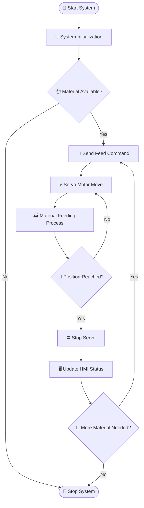

# ⚙️ Automation Feeding System

---

## 📌 Overview

The **Material Feeding System** is an industrial automation project designed to **automatically supply material to a production machine or processing line**. This system integrates **PLC control, HMI interface, and servo motion control** to ensure **accurate, reliable, and efficient material feeding**. This project is suitable for industrial environments such as: 🤖 Automated production lines

---

## 🏗️ System Architecture

The system integrates several industrial automation components:

### 🧠 PLC Controller

**Mitsubishi PLC** manages the main control logic.

Functions:

- Sensor reading
- Motion command trigger
- Safety interlock
- Communication with HMI

---

### 🖥️ Human Machine Interface (HMI)

Operator interface used for monitoring and controlling the system.

Supported HMI devices:

- 🟧 Samkoon HMI
- 🟦 Kinco HMI
- 🟩 Delta HMI

Functions:

- ▶️ Start / Stop system
- 🔧 Manual / Auto mode
- 📊 System monitoring
- 🚨 Alarm display
- 📡 Servo status monitoring

---

### ⚡ Servo Motion System

The feeding mechanism uses **Yaskawa Servo Motor** for high precision movement.

Capabilities:

- 🎯 Position control
- ⚡ Speed control
- 📏 Feeding distance control
- 🔁 Repeatable motion

---

### 🔎 Sensors

Used for system detection and safety.

Examples:

- Material presence sensor
- Position sensor
- Limit switch
- Safety interlock sensor

---

### 🏭 Feeding Mechanism

Mechanical system responsible for delivering material.

Possible implementations:

- Linear feeder
- Belt feeder

---

## 🧩 System Components

| Component      | Description                                |
| -------------- | ------------------------------------------ |
| 🧠 PLC         | Mitsubishi PLC for system control          |
| 🖥️ HMI         | Samkoon / Kinco / Delta operator interface |
| ⚡ Servo Motor | Yaskawa servo motor for motion control     |
| 🔎 Sensors     | Detect material presence and position      |
| 🏭 Feeder      | Mechanical feeding system                  |

---

## 🔄 Control Workflow

---

## 🔌 Hardware Configuration

### 🧠 PLC

Recommended **Mitsubishi PLC Series**

- FX3U
- FX5U

Main responsibilities:

- Process sensor input
- Control feeding logic
- Trigger servo motion
- Communicate with HMI

---

### 🖥️ HMI

Supported HMI platforms:

- Samkoon HMI
- Kinco HMI

Typical HMI pages:

- 🏠 Main operation screen
- 🔧 Manual control screen
- 🚨 Alarm screen
- 📊 System monitoring

---

## 🔗 Communication Architecture

Typical communication configuration:

| Device            | Protocol                 |
| ----------------- | ------------------------ |
| 🖥️ HMI ↔ 🧠 PLC   | Modbus RTU / RS485       |
| 🧠 PLC ↔ ⚡ Servo | Pulse / Position Control |
| 🔎 Sensors        | Digital Input            |

---

## 🛡️ Safety Considerations

Important safety features should be implemented:

- 🛑 Emergency stop circuit
- 🚨 Servo alarm monitoring
- ⚡ Overload protection
- 📏 Limit switch protection
- 🔒 Material jam detection

---

## 🚀 Future Improvements

Possible system enhancements:

- 🌐 IoT monitoring
- 📊 Production data logging
- 🤖 Predictive maintenance
- 🛰️ Remote diagnostics
- 🏭 SCADA integration

---

## 📜 License

This project is released under the [**GNU GPL-v3**](LICENSE).

# 👨‍💻 Author

**HARLEY AD**  
Industrial Automation • PLC Programming • Machine Control Systems
